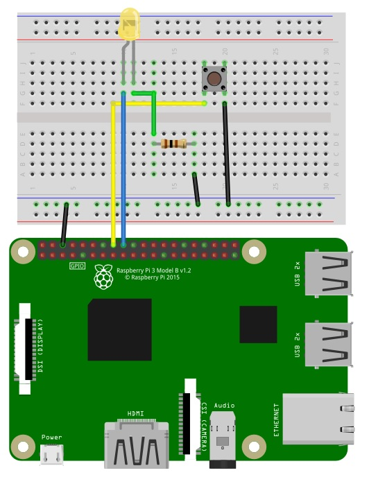

# Button exercise 

### The idea of this exercise :

Pressing the button turns on the light, and pressing it again turns it off.

### Tools :
* Raspberry pi
* LED
* Button
* resistor 

### The Design:

<picture>
  
</picture>

### The code :
[click here](LICENSE.txt)

